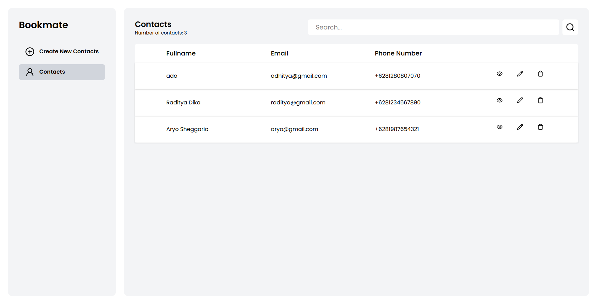
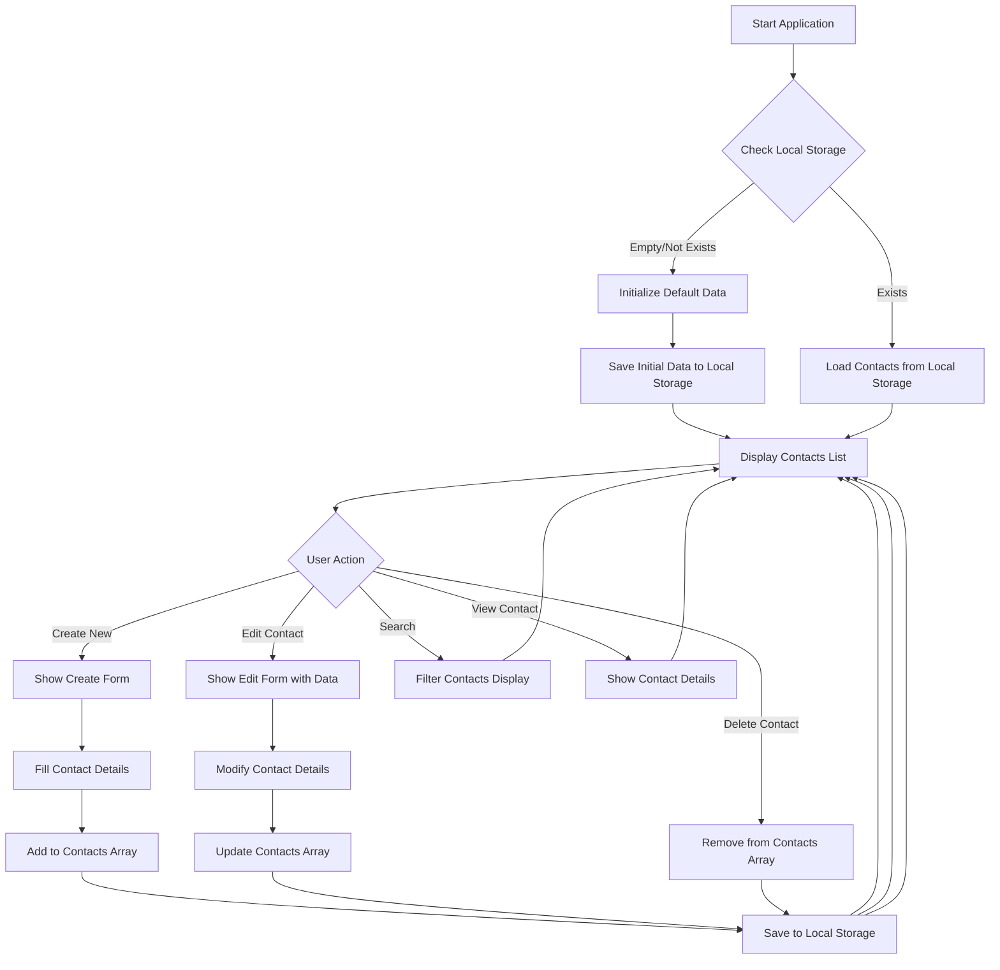
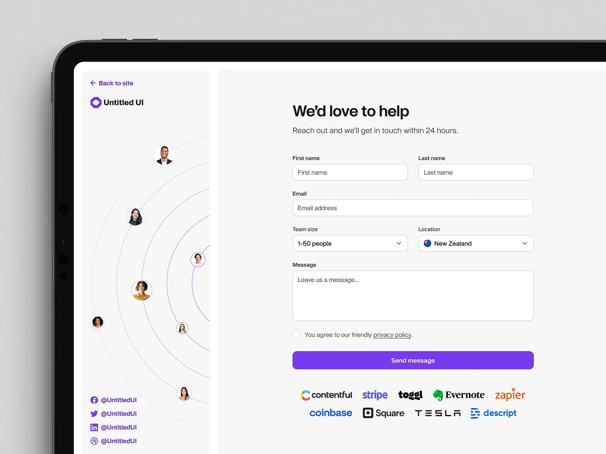

# Bookmate

> 📇 **Bookmate** - A simple contact management application

Bookmate is an application designed to store and manage contact information for important individuals in your network. It serves as a digital address book, allowing you to maintain essential communication details for professional and personal connections.

## Links

- 🌍 URL: [https://booxmate.vercel.app/](https://booxmate.vercel.app/)
- 📦 Repository: <https://github.com/mchmdirvan/bookmate>

## Features

- ➕ Create Contact
- 📖 Read Contact
- ✏️ Update Contact
- 🗑️ Delete Contact
- 👤 Show Contact Details
- 🔍 Search Contacts

## Tech Stack

- HTML
- Javascript
- Tailwind CSS

## Flowchart

## References

